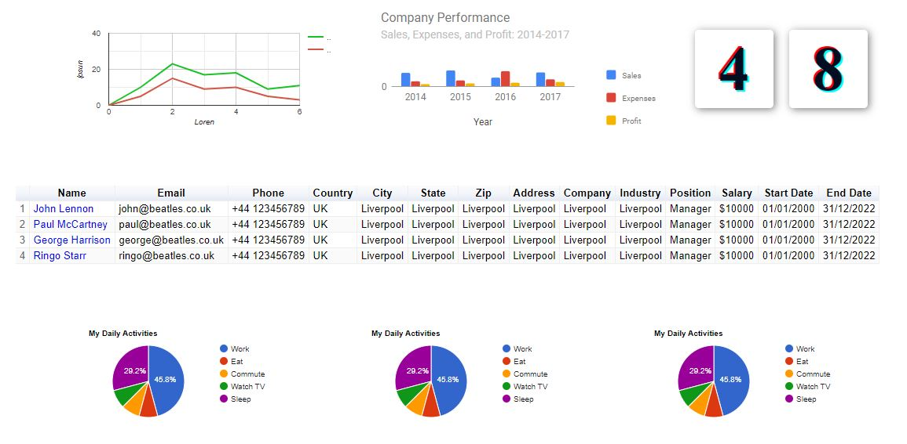

  

## 🚀 Tecnologias

---

Esse projeto foi desenvolvido com as seguintes tecnologias:

- React (create-react-app)
- Typescript
- Styled-components
- React-google-charts

### Rodando localmente

---
1. Instalar todos os pacotes com `yarn install`
2. Executar o comando `yarn dev`
3. Em alguns seguntos a URL: `http://localhost:3000/` ficará disponível.
